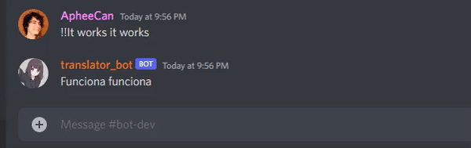
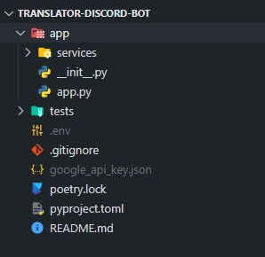

# Discord Translator Bot

## Description

This is a discord bot who translate any language to spanish. 

<br/>

## Technologies used

- [Cloud Translation](https://cloud.google.com/)
- [Discord API](https://discordpy.readthedocs.io/en/stable/)
- [Poetry](https://python-poetry.org/docs/basic-usage/)
- [Discord Developers Portal](https://discord.com/developers/applications)

---

## Installation

After you download the project you need to create two files:
```
.env
google_api_key.json
```
It will look something like this.
<br/>
<br>Now we need our credentials, first let's get the discord token. 
### Discord

On Discord Developer Portal, Applications section create a new application. After that, enter on that new app and create a new Bot on the Bot section at the left side.
<br>Now clic the **Reset Token** button, you will get a long string of characters, copy that and insert it on the .env file.
```
# .env file
DISCORD_TOKEN=TOKENYOUCOPYWITHCONTROLC
```
To invite it to your server go the the OAth2/URL Generator Section, clic on bot and give it the **Send Messages** Text Permission then copy the invite link.
### Google Cloud

To get the json file can be a hassle, but bear it with me.
<br>First you need a Google Cloud account with billing allowed.
<br>Go to the console and create a new project (the name can't be changed later so be careful), the create menu is next to the Google logo.
<br>Use the search bar and type *translation*, that will get you to the market place (don't worry, it won't cost if you are using the free credits) clic on **Cloud Translation API**. Now you need to allow it to your project, just clic on *enable*.
<br>Go the Credentials seccion at the left side then Create a new credential, for this project we will use Service Account. Fill the requested data and clic the **create and continue** button.
<br>Go to the credentials menu, at the bottom, you can see the created account then clic it.
<br>Clic the **Key** Section. When inside, clic the **Add Key** button, a pop-up menu will appear, you need to select the Json format then create. Seconds after the file will be downloaded.
<br>Now you need to add that file your project directory. Use the image at the start of the tutorial as your guide. 
### Poetry

After have all the neccesary credentials, let's run the bot, to do that we will use poetry. You need to have it installed on your system before hand. If not, use the link at [Technologies used](#Technologies-used) to install it. After that, run the commands below to initiate the project.
```
# Install dependencies
poetry install

# Run the application
poetry run python app/app.py
```

## On discord

Below there is a list with available commands with use cases examples.
- **!!**
<br>Translate from any language to spanish.
```
# On the discord app
User-input> !!I want to translate this
Bot-output> quiero traducir esto
User-input> !!Good Bot
Bot-output> buen bot
``` 
 